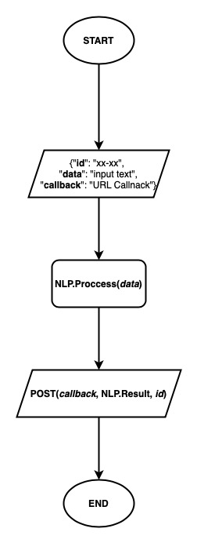

# Natural Language Processing
___
## Services
- [x] Word Clouds
- [x] Sentiment Analytics
- [x] Summary Conversation, _min length string 86_
- [x] Entities Extract 
---

## Installation
### Required
- python3
- pip3
- Redis
- Linux or OS X _Recommendation_
- Storage Min 4GB

### Set up
```shell
> git clone <this repository> nlp
> cd nlp
> pip3 install -r requirement.txt
> python3 test.py
> rq worker --with-scheduler
> python3 web.py
```
---

## Event - Driven Restful for Access Main
### Simple Concept


### Required
- [x] Callback functions
- [x] Mapping Meta Data
---

## Test and Example
#### Use MockAPI [Beeceptor](https://beeceptor.com/), Register and create Mock API like this.

#### Every API set up like this.

### Example
#### Open your postman application and import this collection json.
### Result


---
# Big Thanks
```bibtex
@inproceedings{wilie2020indonlu,
    title       = { IndoNLU: Benchmark and Resources for Evaluating Indonesian Natural Language Understanding },
    author      = { Bryan Wilie and Karissa Vincentio and Genta Indra Winata and Samuel Cahyawijaya and X. Li and Zhi Yuan Lim and S. Soleman and R. Mahendra and Pascale Fung and Syafri Bahar and A. Purwarianti },
    booktitle   = { Proceedings of the 1st Conference of the Asia-Pacific Chapter of the Association for Computational Linguistics and the 10th International Joint Conference on Natural Language Processing },
    year        = { 2020 }
}
@misc {wilson_wongso_2023,
    author      = { {Wilson Wongso} },
    title       = { indonesian-roberta-base-sentiment-classifier (Revision e402e46) },
    year        = { 2023 },
    url         = { https://huggingface.co/w11wo/indonesian-roberta-base-sentiment-classifier },
    doi         = { 10.57967/hf/0644 },
    publisher   = { Hugging Face }
}
@inproceedings{wilie2020indonlu,
    title       = { PySastrawi },
    author      = { Sastrawi },
    url         = { https://github.com/sastrawi/sastrawi },
    year        = { 2017 }
}
```